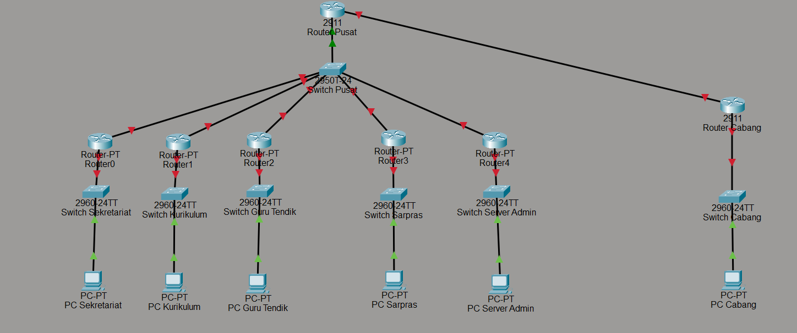

# Tugas-1-Jarkom-Zahra-Hafizhah-5027241121

## Topologi

IP Base = 10.97.0.0

## VLSM

| No  | Nama Subnet            | Network     | Mask            | Prefix | Range Host                 | Broadcast    | Gateway     |
| --- | ---------------------- | ----------  | --------------  | ------ | -------------------------  | -----------  |  ---------- |
| 1   | Sekretariat            | 10.97.0.0   | 255.255.254.0   | /23    | 10.97.0.1 - 10.97.1.254    | 10.97.1.255  | 10.97.0.1   |
| 2   | Kurikulum              | 10.97.2.0   | 255.255.255.0   | /24    | 10.97.2.1 - 10.97.2.254    | 10.97.2.255  | 10.97.2.1   |
| 3   | Guru dan Tendik        | 10.97.3.0   | 225.255.255.128 | /25    | 10.97.3.1 - 10.97.3.126    | 10.97.3.127  | 10.97.3.1   |
| 4   | Sarana Prasarana       | 10.97.3.128 | 255.255.255.192 | /26    | 10.97.3.129 - 10.97.3.190  | 10.97.3.191  | 10.97.3.129 |
| 5   | Pengawas Sekolah       | 10.97.4.0   | 255.255.255.224 | /27    | 10.97.4.1 - 10.97.4.30     | 10.97.3.223  | 10.97.3.193 |
| 6   | Server dan Admin       | 10.97.3.192 | 255.255.255.240 | /28    | 10.97.3.193 - 10.97.3.206  | 10.97.3.231  | 10.97.3.225 |
| 7   | Jaringan Router        | 10.97.3.208 | 255.255.255.248 | /29    | 10.97.3.209 - 10.97.3.214  | 10.97.3.231  | 10.97.3.225 |
| 8   | WAN Link               | 10.97.4.32  | 225.225.225.252 | /30    | 10.97.4.33 - 10.97.4.34    |  10.97.3.235 | 10.97.3.233 |

## CIDR

| No  | Nama Subnet            | Network     | Mask            | Prefix | Range Host                 | Broadcast    | Gateway     |
| --- | ---------------------- | ----------  | --------------  | ------ | -------------------------  | -----------  |  ---------- |
| 1   | Sekretariat            | 10.97.0.0   | 255.255.254.0   | /23    | 10.97.0.1 - 10.97.1.254    | 10.97.1.255  | 10.97.0.1   |
| 2   | Kurikulum              | 10.97.2.0   | 255.255.255.0   | /24    | 10.97.2.1 - 10.97.2.254    | 10.97.2.255  | 10.97.2.1   |
| 3   | Guru dan Tendik        | 10.97.3.0   | 225.255.255.128 | /25    | 10.97.3.1 - 10.97.3.126    | 10.97.3.127  | 10.97.3.1   |
| 4   | Sarana Prasarana       | 10.97.3.128 | 255.255.255.192 | /26    | 10.97.3.129 - 10.97.3.190  | 10.97.3.191  | 10.97.3.129 |
| 5   | Pengawas Sekolah       | 10.97.4.0   | 255.255.255.224 | /27    | 10.97.4.1 - 10.97.4.30     | 10.97.3.223  | 10.97.3.193 |
| 6   | Server dan Admin       | 10.97.3.192 | 255.255.255.240 | /28    | 10.97.3.193 - 10.97.3.206  | 10.97.3.231  | 10.97.3.225 |
| 7   | Jaringan Router        | 10.97.3.208 | 255.255.255.248 | /29    | 10.97.3.209 - 10.97.3.214  | 10.97.3.231  | 10.97.3.225 |
| 8   | WAN Link               | 10.97.4.32  | 225.225.225.252 | /30    | 10.97.4.33 - 10.97.4.34    |  10.97.3.235 | 10.97.3.233 |
